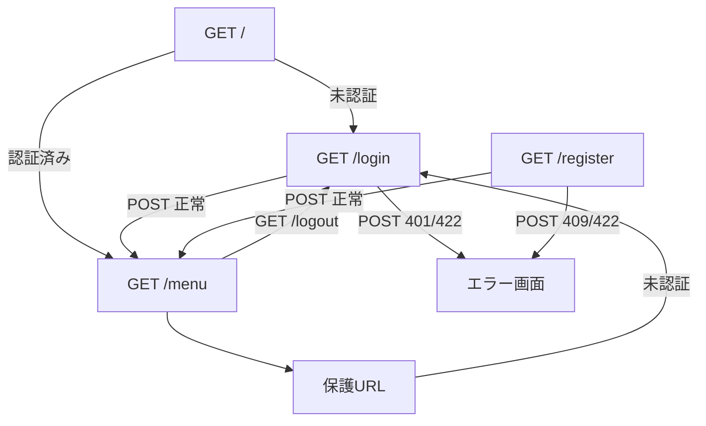

# 画面定義書（T03 認証・セッション）

## jQuery利用
- 利用有無: はい
- ライブラリ名: jQuery 3.7.1
- 理由: 認証フォームの必須入力ガード、パスワード表示切替、ログアウト確認を簡潔に実装するため。
- 対象画面: `/login`, `/register`, `/logout`リンクを含む共通ヘッダー
- 対象要素: `.js-auth-form`, `.js-toggle-password`, `.js-confirm`
- セレクタ/イベント: `submit`, `click`

## 画面一覧
| 画面 | URL | 目的 | テンプレート | CSS | JS |
| --- | --- | --- | --- | --- | --- |
| ルート入口 | `/` | 未認証は`/login`、認証済みは`/menu`へ振り分ける | なし（リダイレクト） | `static/css/style.css` | `static/js/main.js` |
| ログイン | `/login` | 登録済みユーザーの認証 | `templates/auth.html` | `static/css/style.css` | `static/js/main.js` |
| 新規登録 | `/register` | ユーザー登録とセッション開始 | `templates/register.html` | `static/css/style.css` | `static/js/main.js` |
| ログアウト | `/logout` | セッション破棄 | なし（リダイレクト） | `static/css/style.css` | `static/js/main.js` |
| メニュー | `/menu` | 認証後の機能入口 | `templates/menu.html` | `static/css/style.css` | `static/js/main.js` |
| エラー | `/error` | 4xx/5xx系の利用者向け表示 | `templates/error.html` | `static/css/style.css` | `static/js/main.js` |
| 保護プレースホルダー | `/legacy-transfer`, `/profile/edit`, `/points/add`, `/coupons`, `/coupons/use`, `/credit-card`, `/family` | 後続機能URLの認証ガードと開発時確認 | `templates/menu.html` | `static/css/style.css` | `static/js/main.js` |

## 画面遷移

## フォーム項目
### ログイン
- `email`: メールアドレス、必須、最大255文字
- `password`: パスワード、必須、8〜128文字
- `next`: 認証後遷移先、任意

### 新規登録
- `name`: 氏名、必須、最大120文字
- `email`: メールアドレス、必須、最大255文字
- `password`: パスワード、必須、8〜128文字、英字と数字を含む

## ボタン・リンク
- ログインボタン: `/login`へPOST
- 登録ボタン: `/register`へPOST
- 新規登録リンク: `/register`
- ログインリンク: `/login`
- ログアウトリンク: `/logout`、jQuery確認あり
- メニューカード: 各保護URLへ遷移

## HTMLタグ構造
- `base.html`: `html > head > body > header.site-header + main.main-content + footer.site-footer`
- `auth.html`: `section.auth-card#login-screen > form.auth-form`
- `register.html`: `section.auth-card#register-screen > form.auth-form`
- `menu.html`: `section.menu-hero#menu-screen + section.menu-grid`
- `error.html`: `section.error-panel#error-screen`

## 主要ID/Class
- ID: `login-screen`, `register-screen`, `menu-screen`, `error-screen`, `email`, `password`, `name`
- Class: `site-header`, `global-nav`, `auth-card`, `auth-form`, `form-group`, `password-row`, `button`, `primary`, `secondary`, `menu-grid`, `menu-item`, `error-panel`

## CSSクラス一覧
- レイアウト: `.container`, `.main-content`, `.header-inner`, `.site-footer`
- 認証: `.auth-card`, `.auth-form`, `.form-group`, `.password-row`, `.field-help`, `.dev-account-box`
- 操作: `.button`, `.primary`, `.secondary`, `.link-button`
- 通知/エラー: `.flash-list`, `.flash`, `.flash-error`, `.error-panel`, `.error-code`
- メニュー: `.menu-hero`, `.menu-grid`, `.menu-item`, `.user-summary`

## JSイベント一覧
- `.js-toggle-password click`: パスワード表示/非表示を切り替える
- `.js-confirm click`: ログアウト等の確認ダイアログを表示する
- `.js-auth-form submit`: 必須項目の未入力をクライアント側で抑止する
