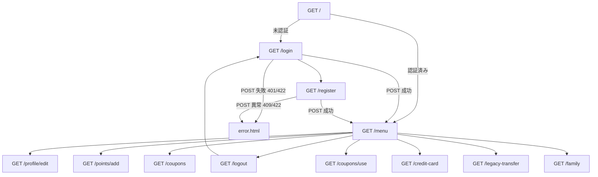

# 画面定義書: T03 認証・セッション・ユーザー入口

## 画面一覧

| 画面 | URL | 目的 | テンプレート | CSS | JS |
| --- | --- | --- | --- | --- | --- |
| ログイン画面 | `/login` | 登録済みユーザーの認証 | `src/point_integrate_system/templates/auth.html` | `src/point_integrate_system/static/css/style.css` | `src/point_integrate_system/static/js/main.js` |
| ユーザー登録画面 | `/register` | 新規ユーザー登録 | `src/point_integrate_system/templates/register.html` | 同上 | 同上 |
| メニュー画面 | `/menu` | 認証後の主要機能入口 | `src/point_integrate_system/templates/menu.html` | 同上 | 同上 |
| ログアウト | `/logout` | セッション破棄後にログインへ遷移 | 直接リダイレクト | 同上 | 同上 |
| 旧サービス連携 | `/legacy-transfer` | 認証後の旧サービス連携入口 | `menu.html` | 同上 | 同上 |
| プロフィール編集 | `/profile/edit` | 認証後のプロフィール編集入口 | `menu.html` | 同上 | 同上 |
| ポイント追加 | `/points/add` | 認証後のポイント追加入口 | `menu.html` | 同上 | 同上 |
| クーポン一覧 | `/coupons` | 認証後のクーポン一覧入口 | `menu.html` | 同上 | 同上 |
| クーポン利用 | `/coupons/use` | 認証後のクーポン利用入口 | `menu.html` | 同上 | 同上 |
| クレジットカード | `/credit-card` | 認証後のカード管理入口 | `menu.html` | 同上 | 同上 |
| ファミリー共有 | `/family` | 認証後のファミリー共有入口 | `menu.html` | 同上 | 同上 |
| パスワード再設定依頼 | `/password-reset/request` | 再設定依頼の開発時表示 | `auth.html` | 同上 | 同上 |
| パスワード再設定 | `/password-reset/<token>` | トークン付き再設定の開発時表示 | `auth.html` | 同上 | 同上 |
| エラー画面 | `/error` および 4xx/5xx | 認証・登録異常系や404表示 | `src/point_integrate_system/templates/error.html` | 同上 | 同上 |

## 画面遷移フロー

## フォーム項目

### ログインフォーム
- `email`: type=email、必須、最大255文字。
- `password`: type=password、必須、最大128文字。

### 登録フォーム
- `name`: type=text、必須、最大120文字。
- `email`: type=email、必須、最大255文字。
- `password`: type=password、必須、最大128文字、8文字以上かつ英字・数字を含む。
- `confirm_password`: type=password、必須、`password` と一致。

## ボタン・リンク

- ログイン: `POST /login`。
- 新規登録: `GET /register`。
- 登録してメニューへ: `POST /register`。
- ログアウト: `GET /logout`。クリック時に確認ダイアログを表示。
- メニュー項目: `/profile/edit`, `/points/add`, `/coupons`, `/coupons/use`, `/credit-card`, `/legacy-transfer`, `/family`。

## HTMLタグ構造

- `base.html`: `html > head > link[stylesheet]`, `body > header.site-header`, `main.page-shell`, `footer.site-footer`, `script[jQuery]`, `script[main.js]`。
- `auth.html`: `section.card.auth-card > h1 + p.lead + form.auth-form`。
- `register.html`: `section.card.auth-card > h1 + p.lead + form.auth-form`。
- `menu.html`: `section.card.menu-card > h1 + div.menu-grid + div.button-row`。
- `error.html`: `section.card.error-card > p.eyebrow + h1 + p.lead + div.button-row`。

## 主要ID / class一覧

### ID
- `login-title`
- `register-title`
- `menu-title`
- `error-title`
- `email`
- `password`
- `name`
- `confirm_password`
- `password-help`

### class
- `site-header`
- `site-header__inner`
- `site-logo`
- `site-nav`
- `page-shell`
- `card`
- `auth-card`
- `menu-card`
- `error-card`
- `lead`
- `notice`
- `eyebrow`
- `auth-form`
- `form-field`
- `helper-text`
- `button-row`
- `button`
- `button-primary`
- `button-secondary`
- `button-danger`
- `menu-grid`
- `menu-item`
- `site-footer`
- `is-invalid`

## CSSクラス一覧

`style.css` はレスポンシブなカード型レイアウト、フォーム、ボタン、メニューグリッド、エラー表示、モバイル時の縦並びを定義する。

## JSイベント一覧

- `click` on `[data-confirm-logout="true"]`: ログアウト確認ダイアログ。
- `submit` on `.auth-form`: テキスト入力のtrim、必須項目の簡易検証、二重送信抑止。
- `input` on `#password`: 8文字未満の視覚的警告。

## jQuery利用

- jQuery使用: はい。
- ライブラリ名: jQuery 3.7.1 CDN。
- 理由: フロントエンドスタック指定が `jquery` のため、フォーム補助とログアウト確認をjQueryで実装する。
- 対象画面: ログイン、登録、メニュー、認証済み各入口。
- 対象HTML要素とセレクタ/イベント:
  - `[data-confirm-logout="true"]` / `click`
  - `.auth-form` / `submit`
  - `#password` / `input`
